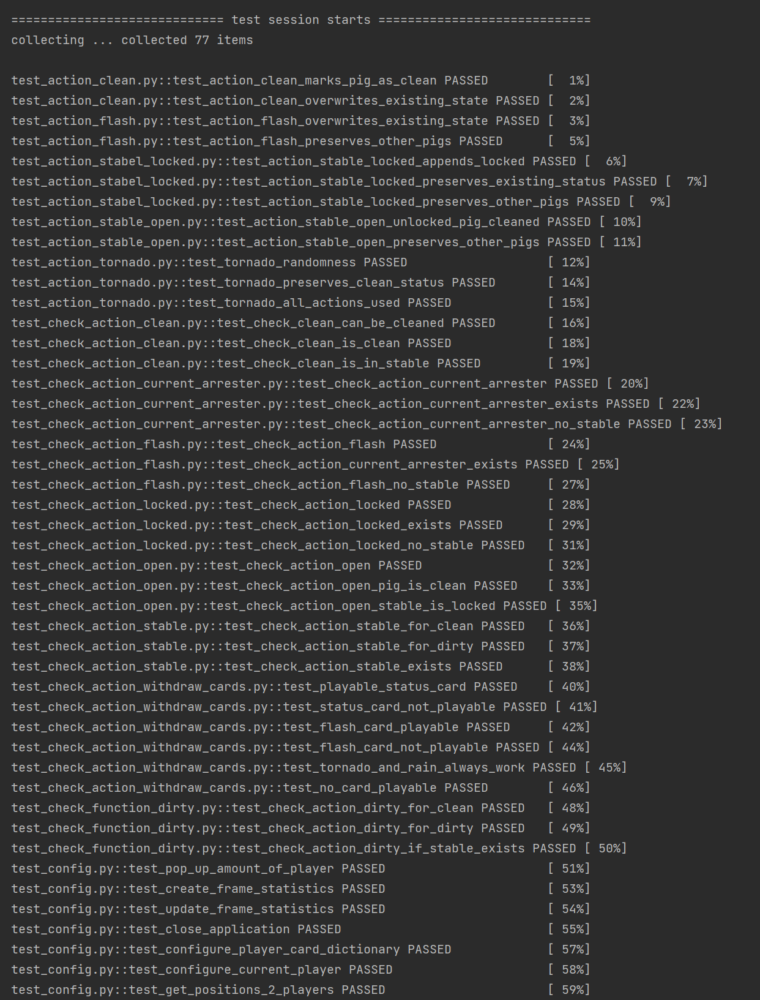
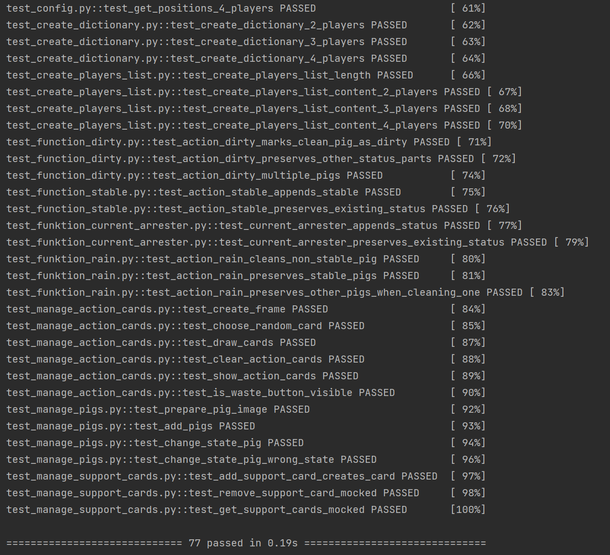

#Testkonzept

##Backend- und Logiktests

Dieses Testkonzept beschreibt die systematische Prüfung der Spiel-Backend- und Logikkomponenten des Spiels Drecksau, das in Python unter Verwendung von tkinter entwickelt wird.
Der Fokus liegt auf deterministischer, reproduzierbarer und automatisierter Validierung der spielrelevanten Kernfunktionalität – unabhängig von der grafischen Benutzeroberfläche.

**Methodik:** Alle Tests werden mit **pytest** ausgeführt.  

**Testtiefe:** Unit-Tests sichern jede Funktion ab.

##Frontend Tests

Das Frontend-Testkonzept überprüft die korrekte Verwaltung von Support-Karten in der GUI unabhängig von der tatsächlichen Darstellung. Dabei werden alle GUI-Elemente und Bildoperationen durch Mocks ersetzt, sodass die isoliert getestet werden können. Ziel ist es sicherzustellen, dass Funktionalität der Kartenverwaltung im Frontend korrekt ist.

**Methodik**: Alle Tests werden mit **pytest** ausgeführt.

**Testtiefe**: Unit Tests mit Mocking.

Alle GUI-Komponenten (CTk, CTkLabel, Frame, Image.open, ImageTk.PhotoImage) werden gemockt, damit die Tests headless und schnell laufen.

- Fixtures:
    - root_window: simuliertes Hauptfenster für Spieler-Frames.
    - mock_gui_elements: globale Mocks für GUI-Klassen und Bilder.

- Fokus: Logik der Frontend-Funktionen unabhängig von der tatsächlichen GUI-Bibliothek testen.

##control_panel.py

control_panel.py kann nicht direkt getestet werden, weil beim Import sofort Pop-Ups und das Hauptfenster gestartet werden.
Die mainloop() blockiert die Ausführung von Tests.
Fast alle Funktionen greifen direkt auf globale GUI-Objekte zu.
Globale Variablen wie current_player und Spieler-Dictionaries erschweren die Isolation der Logik.

###Testprotokoll
[**Hier**](dokumente_/Test_Protokoll.pdf) befindet sich das PDF vom **Testprotokoll**. Darunter sieht ihr Bilder zuden Test-Resultaten.

##Test-Resultate:
{ width="310" }
{ width="310" }

??? note "Test-Funktionen:"
    
    ::: tests
        options:
          show_submodules: true
          members: true
          heading_level: 3